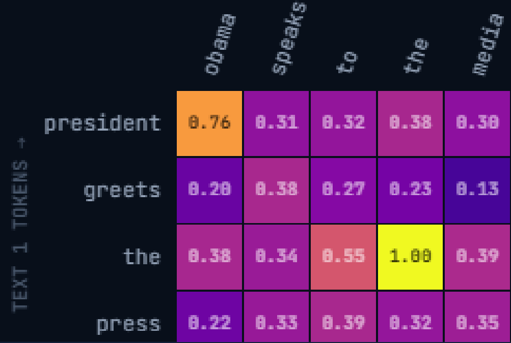
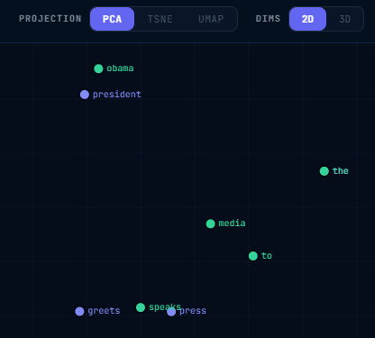
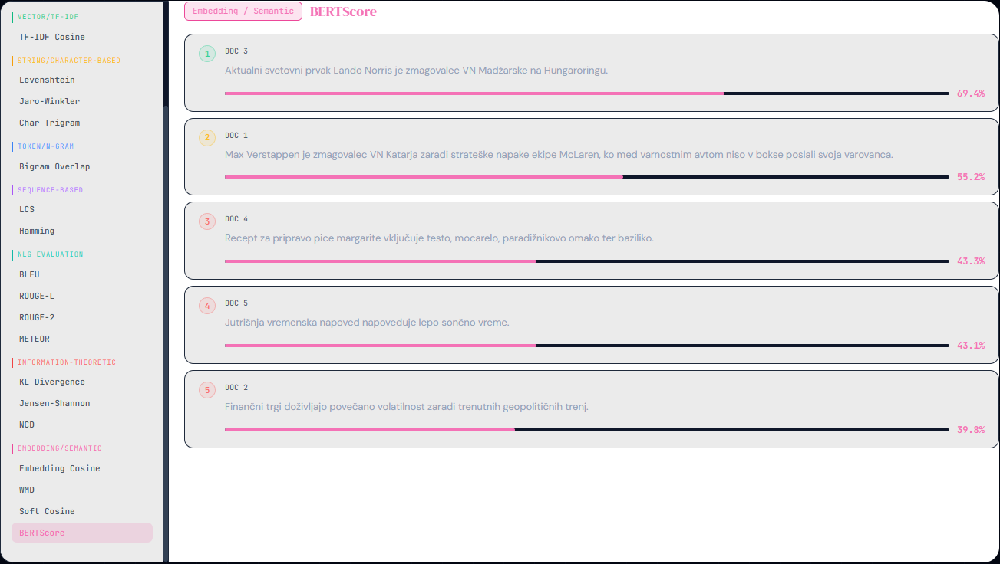

# Orodje za pregled in primerjavo metrik podobnosti besedil

Spletna aplikacija uporabniku omogoča vnos dveh besedil, in prikaže vpogled v to kako različne metrike in vektorski modeli ocenijo, kako podobni sta si ti dve besedili.

## Funkcionalnosti

### Primerjava dveh besedil po več metrikah hkrati

Uporabnik vnese dve besedili, aplikacija pa izračuna njuno podobnost po metrikah iz več skupin:

- **metrike na osnovi množic besed** (Jaccard, Sørensen–Dice),
- **vektorske metrike** (TF-IDF),
- **znakovne metrike** (Levenshtein, Jaro–Winkler),
- **metrike na osnovi zaporedij** (LCS),
- **evalvacijske metrike za generiranje besedil** (BLEU, ROUGE, METEOR),
- **informacijsko-teoretične metrike** (KL divergence, Jensen–Shannon divergence, NCD),
- **semantične metrike na osnovi vektorskih vložitev** (kosinusna podobnost, Word Mover's Distance, Soft Cosine Measure, BERTScore).

Vsaka metrika je prikazana v svoji kartici, skupaj s kratkim opisom in označenimi besedami iz besedil, ki so k izračunani oceni prispevale največ.

### Izbira vektorskega modela

Uporabnik lahko izbira med več vnaprej pripravljenimi vektorskimi modeli (splošni angleški modeli, večjezični modeli, modeli za specifične domene ipd.), s čimer lahko neposredno primerja, kako izbira modela vpliva na oceno podobnosti istega para besedil.

### Predobdelava besedila

Pred izračunom podobnosti je mogoče besedilo poljubno predobdelati:
- pretvorba v male črke,
- odstranjevanje ločil,
- odstranjevanje nepomembnih besed (za izbrani jezik)

### Dvodimenzionalna barvna predstavitev prispevka posameznih besed

Za vsako metriko je na voljo tudi podrobnejši prikaz v obliki dvodimenzionalne barvne predstavitve, ki na nivoju matrike beseda × beseda pokaže, kako si posamezne besede iz obeh besedil med seboj prispevajo k izračunani meri podobnosti.



### Vizualizacija vektorskega prostora

Aplikacija omogoča tudi vizualni prikaz vektorskega prostora besed obeh besedil, z izbiro med tremi metodami zmanjševanja dimenzionalnosti (PCA, t-SNE, UMAP) ter dvo- ali tridimenzionalnim prikazom.



### Umetno popačenje besedila

Za preizkušanje robustnosti posameznih metrik je na voljo tudi možnost umetnega popačenja besedila:
- premešanje vrstnega reda besed,
- vnašanje tipkarskih napak,
- dodajanje šuma

### Korpusni način

Poleg primerjave dveh besedil aplikacija ponuja tudi način *Corpus mode*, kjer uporabnik eno besedilo (poizvedbo) primerja hkrati z več dokumenti (korpus). Rezultat je za vsako metriko razvrstitev vseh dokumentov od najbolj do najmanj relevantnega glede na poizvedbo, kar na razumljiv način demonstrira postopek pridobivanja dokumentov (*retrieval*), ki je prvi korak pristopov RAG tehnologij. Rezultate je mogoče pregledovati v obliki razvrščenega seznama ali matričnega prikaza.



## Zagon aplikacije

### Zaledni del

```bash
cd backend
python -m venv venv
source venv/bin/activate
pip install -r requirements.txt
python app.py
```

### Čelni del

```bash
cd frontend/frontend
npm install
npm run dev
```
